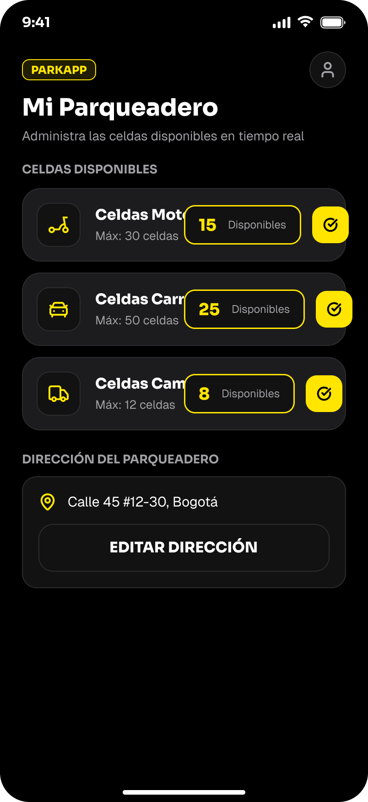
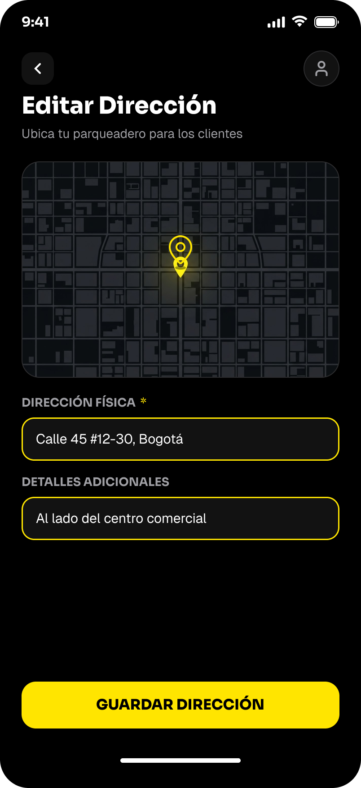
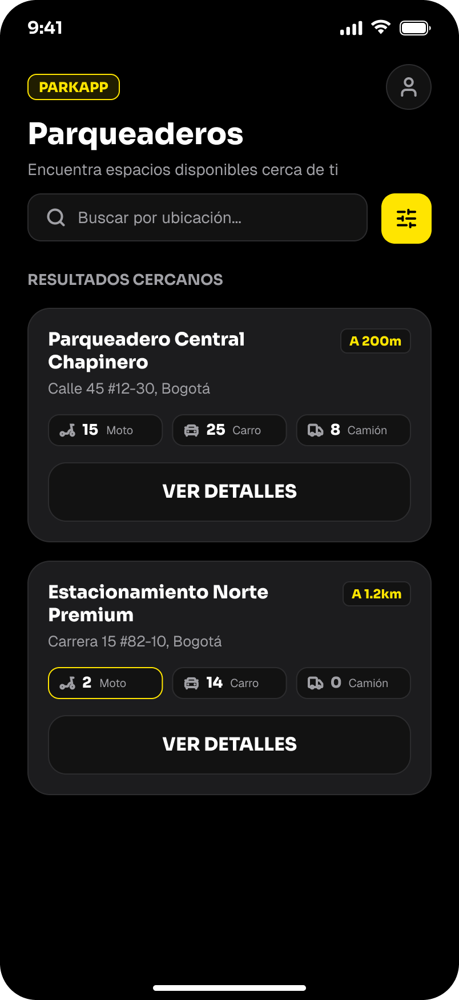
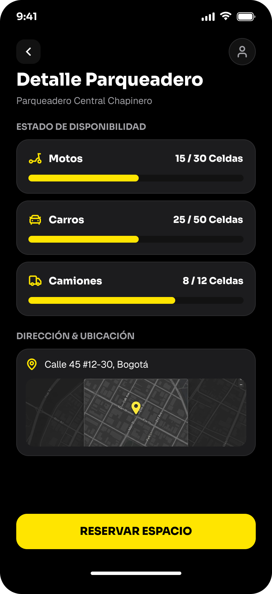

# Parquea-Lava


en la imagen se puede ver el inicio de sesion que aparece al estar abriendo la aplicacion movil y esta el boton de entrar. si no tienes cuenta puedes registrarte.

---


en la imagen se muestra de que en el formulario de registro esta la opcion de elegir si es el dueño de un parqueadero o el usuario. 

---



en esta imagen se muestra el apartado de la cuenta del dueño en la que puede estar agregando las celdas y sus costos incluyendo de que puede poner la ubicacion de su parqueadero

---



en esta imagen se muestra la opcion de que el dueño pueda poner la ubicacion de su parqueadero para que el usuario pueda llevar su vehiculo.

---



en la imagen se muestra el mapa de los parqueaderos cercanos al usuario y que pueda poner la ubicacion del parqueadero, la disponibilidad de las celdas y el precio por hora.

---



en esta imagen se muestra el apartado del usuario en la que puede estar viendo las celdas disponibles y el precio por hora y se muestra la ubicacion del parqueadero.

## paleta de colores

- amarillo: FFE600
- negro: 000000
- blanco: FFFFFF

## flujo de la app

```text
                  [ Pantalla Inicial ]
                            │
            ┌───────────────┴───────────────┐
            ▼                               ▼
 [ Formulario de Login ]         [ Formulario de Registro ]
            │                               │
            └───────────────┬───────────────┘
                            ▼
              ¿Tipo de usuario registrado?
                            │
            ┌───────────────┴───────────────┐
            ▼                               ▼
   [ Dueño de Parqueadero ]            [ Cliente ]
            │                               │
 ┌──────────┴──────────┐         ┌──────────┴──────────┐
 ▼                     ▼         ▼                     ▼
[Gestión de Celdas]  [Ubicación][Consulta Celdas]  [Ver Ubicación]
 - Motos              - Dirección - Motos            - Dirección
 - Carros             - Mapa      - Carros           - Mapa
 - Camiones                       - Camiones